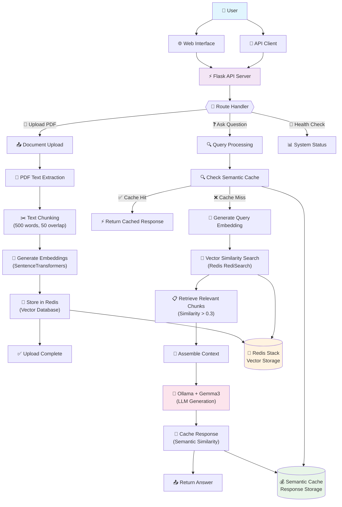

# Knowledger 🧠

> An intelligent RAG (Retrieval-Augmented Generation) system that transforms your documents into a conversational knowledge base

## ✨ What Makes Knowledger Special

**Smart Document Understanding** - Upload PDFs and get instant semantic search capabilities across your entire document collection

**Lightning-Fast Responses** - Powered by Ollama's Gemma3 model with intelligent semantic caching for sub-second query responses

**Production-Ready Architecture** - Built with Redis vector storage, SentenceTransformers embeddings, and containerized deployment

## 🚀 Key Features

### 📄 Intelligent Document Processing
- **PDF Text Extraction** with smart chunking (500 words, 50-word overlap)
- **Semantic Embeddings** using `multi-qa-mpnet-base-dot-v1` for superior context understanding
- **Vector Storage** in Redis with RediSearch for millisecond retrieval

### 🔍 Advanced Search & Retrieval
- **Semantic Search** - Find relevant content even with different wording
- **Context-Aware Responses** - Combines multiple document chunks for comprehensive answers
- **Smart Caching** - Semantic similarity-based caching reduces redundant LLM calls

### 🎯 Modern Tech Stack
```
🐳 Docker Compose    →  One-command deployment
🔗 Redis Stack       →  Vector database with RediSearch
🤖 Ollama + Gemma3   →  Local LLM inference
🧠 SentenceFormers   →  State-of-the-art embeddings
⚡ Flask API          →  RESTful backend
🎨 Modern Web UI     →  Clean, responsive interface
```

## 🏗 Architecture Overview

Knowledger implements a sophisticated RAG pipeline that intelligently processes documents and provides contextual answers:

**Document Ingestion Flow:**
PDF → Text Extraction → Intelligent Chunking → Vector Embedding → Redis Storage

**Query Processing Flow:**
User Question → Embedding → Vector Search → Context Assembly → LLM Generation → Response

**Smart Features:**
- 🎯 Similarity threshold filtering for relevant context
- 💾 Semantic caching for frequently asked questions  
- 📊 Performance monitoring and health checks
- 🔄 Real-time document indexing

## 🎪 Getting Started

Simply run with Docker Compose - everything is pre-configured:

```bash
docker-compose up
```

That's it! Your intelligent document assistant is ready at `http://localhost:5000`

## 💡 Perfect For

- **Research Teams** - Query across multiple research papers instantly
- **Documentation** - Transform static docs into interactive knowledge bases  
- **Customer Support** - Build intelligent FAQ systems from your content
- **Content Analysis** - Discover insights across large document collections

---

## Works like this 
